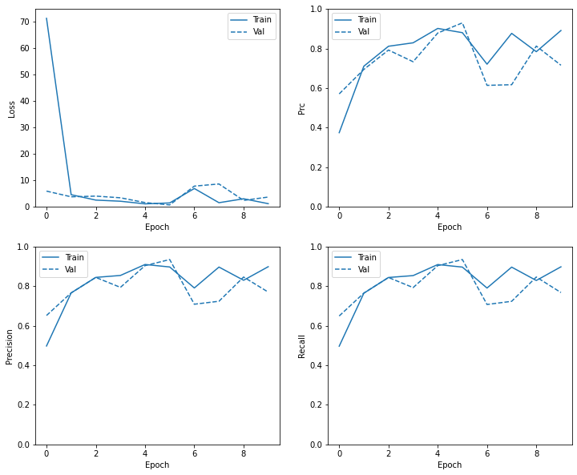
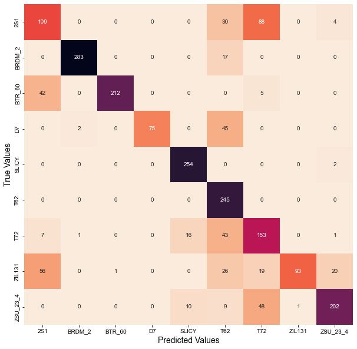

## Target Idenfication using Deep Learning

The goal of this project is to create a model that accurately identifies 9 different types of vehicles classes in sythetic aperture radar (SAR) satellite imagery.

As a first step, I created a basic model using all dense layers.

The figure above depicts selected metrics over 10 epochs.

The confusion matrix above shows model performance on the validation dataset. This suggests that we need a more complex model to achieve more satisfactory results.

As a next step, I will try some convolution layers, try transfer learning, and run my dataset through some SOTA model architectures available through tensorflow. I will continue to evaluate the results and select the best-performing model as my final result.
